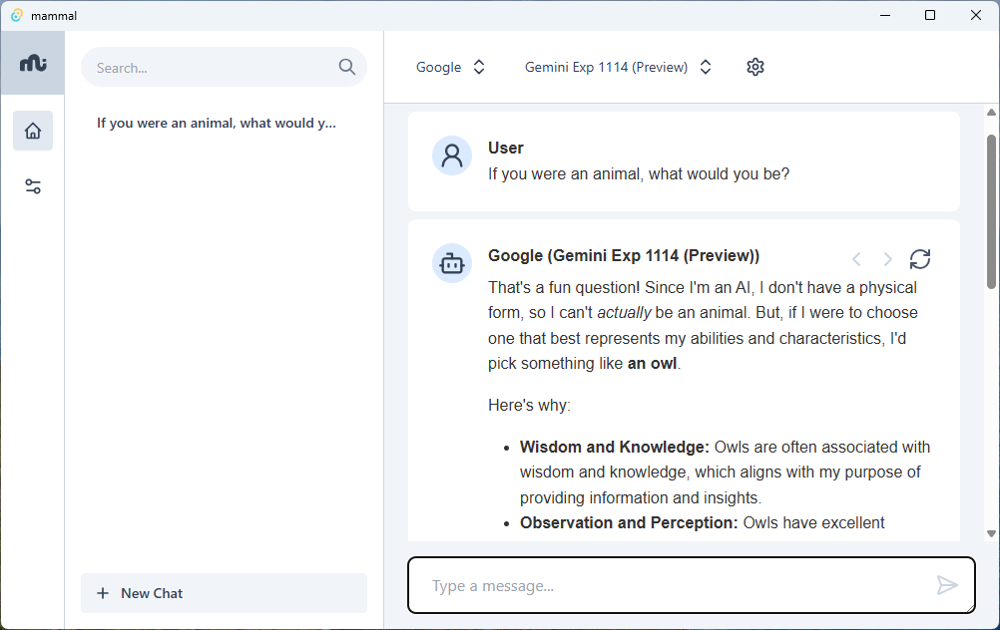

# Mammal

Mammal is an LLM client application that allows users to have chat conversations with LLM providers.

# Supported Providers

- [x] OpenAI
- [x] Google
- [x] Anthropic
- [x] Groq
- [x] Cerebras
- [x] Custom OpenAI API Compatible Providers (like llama.cpp and ollama)
- [ ] Others

# Features

**Threads**: Most of the complicated coding has gone into supporting threaded conversations that allow forking. The LLM called by Mammal can be changed from message to message, and the conversation can be forked into multiple threads. There are bugs here that are hard to reproduce, and there's probably a nasty refactor needed to fix them.

**FTS Search**: It is also possible to search your conversations for specific content. The search functionality is backed by a SQLite's FTS.

**Attachments**: You can attach `.doc(x)` files to conversations. These files are converted to markdown and sent to the LLM as part of the conversation. This enables the use of text-only models for document analysis.

# Roadmap (i.e., ideas)

- [ ] Papercuts:
  - [ ] Better support for scrolling to searched messages
  - [ ] Remembering previous model selection
  - [ ] Better error handling
  - [x] Deleting subtrees within threads
  - [ ] Automatic cleaning up of sqlite message tree
  - [ ] Bug hunting with threads
- [ ] Automatically downloading list of available models for known providers
- [-] Support for more document types (pdf...)
- [ ] Support for more providers(?)
- [ ] Pro "workspace" features?

# Stack

- Tauri
- React
- Tailwind CSS
- React-markdown (with gfm)
- LLM sdks (OpenAI and Anthropic)
- SQLite

Honestly, very few dependencies.

# Building

1. Clone the repository
2. `npm install`
3. `npm run tauri build`

For development, you can use `npm run tauri dev`.

You will need rust and nodejs installed.

# Contributing

Contributions are welcome. Please open an issue or a PR.
You will need to sign the CLA.
